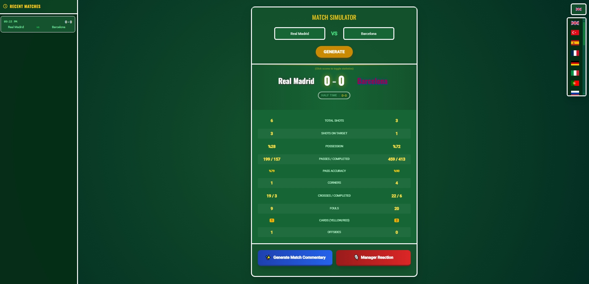

# Match-Simulator
Interactive Football Match Simulator powered by Gemini AI. Features realistic match engine, dynamic statistics, and AI-generated journalistic commentary with manager reactions. Built with Tailwind CSS, supporting 20+ languages for a global experience. ⚽✨
# ⚽ AI-Powered Football Match Simulator

A sophisticated web-based football match simulator that generates realistic match statistics and uses **Gemini AI** to create engaging journalistic match commentaries and post-match manager reactions.

## ✨ Features
* **Realistic Match Engine:** Generates logical match outcomes and detailed statistics (possession, shots, cards, etc.) based on a dynamic algorithm.
* **Gemini AI Integration:** Provides automated, context-aware match stories and press conference simulations.
* **Multilingual Support:** Fully localized in over 20 languages including English, Turkish, Spanish, French, and more.
* **Modern UI:** A sleek, "pitch-themed" responsive interface built with **Tailwind CSS**.
* **Match History:** Keeps track of your recent simulations during the session.

## 🚀 Tech Stack
* **Frontend:** HTML5, Tailwind CSS, Vanilla JavaScript
* **AI Engine:** [Google Gemini API](https://ai.google.dev/)
* **Fonts:** Google Fonts (Oswald & Roboto)

## 🛠️ How to Use
1.  Clone or download this repository.
2.  Open `index.html` in any modern web browser.
3.  *(Optional)* To enable AI features, insert your Gemini API Key into the `apiKey` variable within the script section.
4.  Enter the Home and Away team names.
5.  Click **"GENERATE"** to start the simulation!

## 📸 Preview

*(Note: Replace this placeholder with a real screenshot of your app once hosted!)*

## ⚖️ License
This project is open-source and available under the MIT License.
